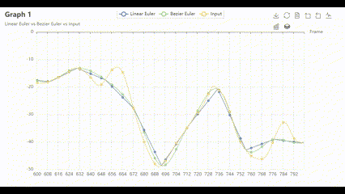

# Motion Capture Interpolation

## Overview

This project implements three interpolation schemes for human motion data obtained from an optical motion capture system. 
The goal is to analyze and compare the performance of these interpolation techniques: Linear Euler, Bezier Euler, SLERP Quaternion, and Bezier SLERP Quaternion.

   |          Linear Euler (baseline)               |             Bezier Euler             |             SLERP Quaternion             |             Bezier SLERP Quaternion             |
   :-----------------------------------------------:|:------------------------------------:|:----------------------------------------:|:-----------------------------------------------:|
                |  |  |  |

   *Note: Interpolations on every 15 frames for skeleton `mocapPlayer-starter/131-dance.asf` and motion `mocapPlayer-starter/131_04-dance.amc`. The ground truth is shown in red, while the interpolation is shown in green. The two motions are displayed on top of each other. The closer these two motions are, the better the interpolation scheme is.*

## Functionalities

### Core Accomplishments
1. Implemented conversions between Euler angles and Quaternions, along with Euler angles to rotation matrices.
2. Implemented three interpolation methods: Linear Quaternion (SLERP), Bezier Euler, and Bezier Quaternion (Bezier SLERP).
3. Plotted interactive graphs and reported [observations](report.md). Interactive graphs can be viewed from `docs/graph/xxx.html`.

### Additional Features

1. **Supported random keyframe intervals generation and non-uniform keyframe interpolation for all four methods.**
   
   To perform non-uniform keyframe interpolation, simply change `N` to `-N` when using interpolator.
   
   It assumes both head and tail frames are keyframes, and sets $n_i$ frames as random intervals for $i$-th interval, where $1 \le n_i \le N$.  For reproducibility, `0` is set as the random seed.
   
   

2. **Performed computation time analysis.**

   See [the report](report.md) for details.


3. **Improved lighting, background, and ground settings to make the scene appealing.**
   
   

4. **Addressed the side case when only two keyframes are used in Bezier interpolation.**
   
   This will downgrade to corresponding linear interpolation. For example, Bezier Euler to Linear Euler; or Bezier Quaternion to Linear Quaternion.


5. **Provided interactive graphes.**
   
   


## How to run

There are two steps to run this project:

1. Interpolate a given motion.
   
   On Windows PowerShell:
   ```PowerShell
   # .\interpolate.exe <PATH_TO_AMF> <PATH_TO_GROUND_TRUTH_AMC> <`l` or `b`> <`e` or `q`> <NUM_INTERVALS> <PATH_TO_OUTPUT_AMC> 
   # For example: 
   .\interpolate.exe .\mocapPlayer-starter\131-dance.asf .\mocapPlayer-starter\131_04-dance.amc l q 15 Dance_SLERP_15.amc
   ```

   On macOS Terminal:
   ```shell
   # ./interpolate <PATH_TO_AMF> <PATH_TO_GROUND_TRUTH_AMC> <`l` or `b`> <`e` or `q`> <NUM_INTERVALS> <PATH_TO_OUTPUT_AMC> 
   # For example: 
   ./interpolate ./mocapPlayer-starter/131-dance.asf ./mocapPlayer-starter/131_04-dance.amc l q 15 Dance_SLERP_15.amc
   ```
   
   where `l` stands for `Linear Interpolation`, `b` stands for `Bezier Interpolation`; `e` stands for interpolation in `Euler`, `q` stands for interpolation in `Quaternion`.

2. Display the motions.

   On Windows: Double-click `mocapPlayer.exe` to open the player.
   
   On macOS:
   ```shell
   ./mocapPlayer  # Open the player
   ```
   
   In the player, click `Load Skeleton` to select an `.amf` file (_e.g._, `mocapPlayer-starter/131-dance.asf`), and then click `Load Motion` to load an `.amc` motion file (_e.g._, `mocapPlayer-starter/131_04-dance.amc`).
   You can repeat above steps to overlay up to three motions and play back them together.

Both Windows (x86, Win 11) and macOS (x86, 12.6) executable are tested.

If you are interested in compiling from scratch, please follow [Code Setup Instruction](setup_instruction.md).

## Acknowledge

The starter code (_i.e._, API and window) comes from course [CSCI 520 Computer Animation and Simulation](https://viterbi-web.usc.edu/~jbarbic/cs520-s23/), taught by [Professor Jernej Barbič](http://viterbi-web.usc.edu/~jbarbic/).