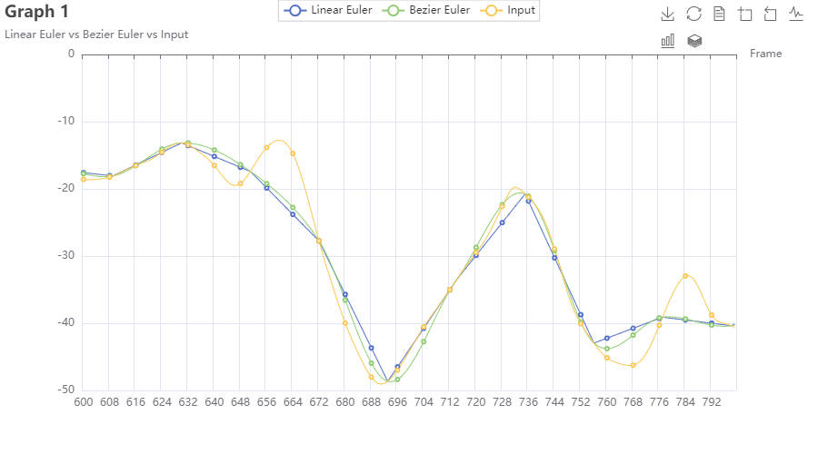
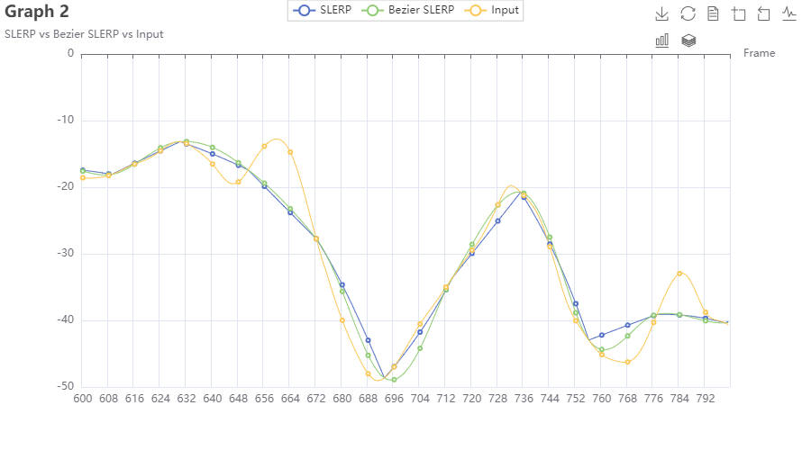
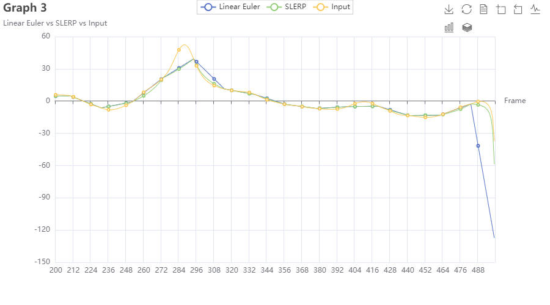
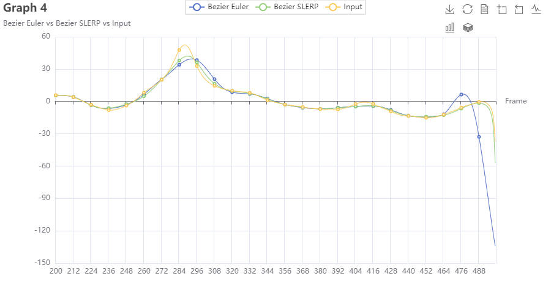

> Test platform: Windows 11, Intel i5-13600k

|                              | Linear Euler | Linear Quaternion (SLERP) | Bezier Euler | Bezier Quaternion (Bezier SLERP) |
| ---------------------------- | ------------ | ------------------------- | ------------ | -------------------------------- |
| 131_04-dance.amc, N=20       | 0.055330 ms  | 0.314801 ms               | 0.260682 ms  | 0.369693 ms                      |
| 135_06-martialArts.amc, N=40 | 0.171854 ms  | 0.962807 ms               | 0.784105 ms  | 1.070574 ms                      |

In these two test cases, for computation time, Linear Euler < Bezier Euler < Linear Quaternion < Bezier Quaternion. Switching from Linear interpolation to Quaternion interpolation results in a significant increase in running time. This may be due to the overhead introduced by converting Euler angles and Quaternions back and forth (we need to set poses in Euler angles in mocapPlayer). Switching from Linear interpolation to Bezier interpolation also increases the computation time, which mainly comes from retrieving the preceding and subsequent keyframes' poses.

Graph 1

Graph 1 compares Linear Euler with Bezier Euler interpolation (and input). As shown in the graph, Linear Euler consists of straight segments connecting keyframes, while Bezier Euler provides smooth curves. However, in cases of sudden changes between keyframes (e.g., Frame 651-672), both methods fail to reveal the input ground truth motion.

Graph 2

Graph 2 compares SLERP Quaternion with Bezier SLERP Quaternion interpolation (and input). As shown in the graph, SLERP appears as straight segments connecting keyframes, while Bezier SLERP provides smooth curves. Again, in cases of sudden changes between keyframes (e.g. Frame 651-672), both methods fail to reveal the input ground truth motion. However, compared with other methods, in Frame 756-777, Bezier SLERP provides smoother curves to avoid stiff rotations, thus producing better results.

Graph 3

Graph 3 compares Linear Euler with SLERP Quaternion (and input). As shown in the graph, although both Linear Euler and SLERP perform linear interpolation, SLERP yields smoother results (e.g., Frame 294-315). This is because SLERP performs linear interpolation on Quaternions instead of Euler angles.

Graph 4

Graph 4 compares Bezier Euler to Bezier SLERP Quaternion (and input). As shown in the graph, although both Bezier Euler and Bezier SLERP perform Bezier interpolation, Bezier Euler yields weird rotaions (e.g., Frame 462-483). This is because Bezier Euler performs interpolation on Euler angles instead of Quaternions.

Together with the time analysis, here's my summary of these four interpolation methods:

|      | Linear Euler                             | Linear Quaternion (SLERP) | Bezier Euler                                            | Bezier Quaternion (Bezier SLERP)                     |
| ---- | ---------------------------------------- | ------------------------- | ------------------------------------------------------- | ---------------------------------------------------- |
| Pros | Intuitive and easy-to-compute            | Smooth rotation           | Smooth velocity                                         | Smooth rotation and velocity, no Gimbal lock problem |
| Cons | Gimbal lock, weird rotation and velocity | Weird velocity            | Sometimes weird rotation, also suffers from Gimbal lock | Time-consuming for implementation and computation    |
